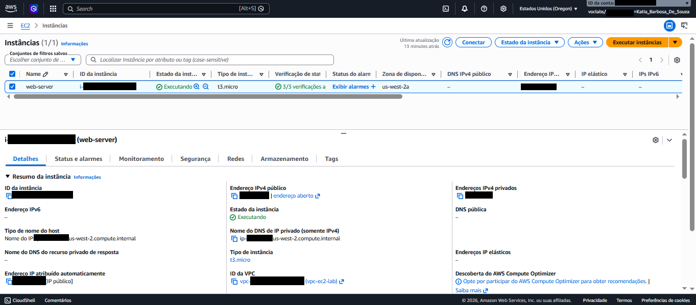
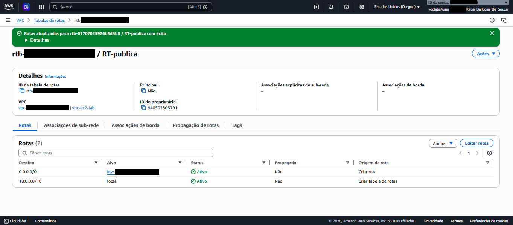
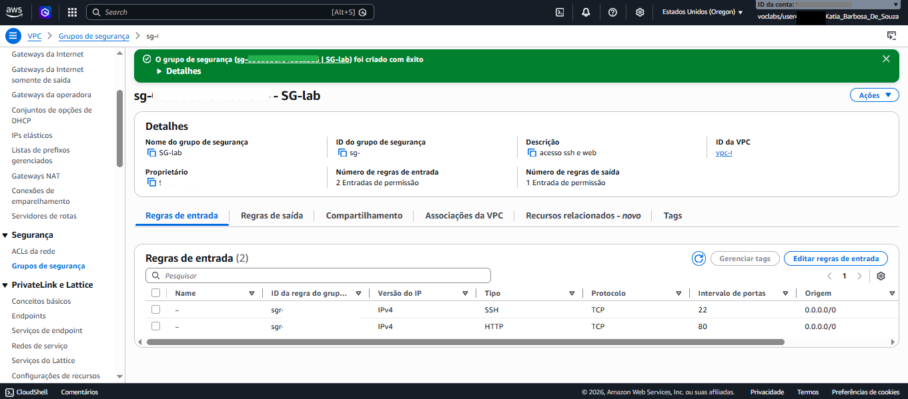
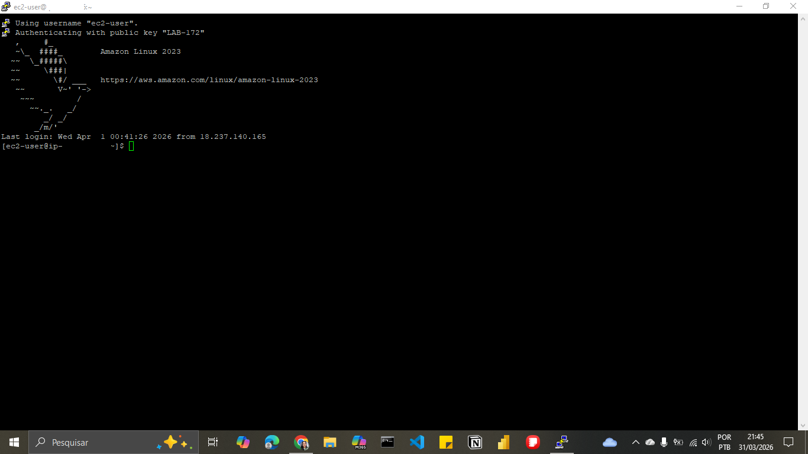
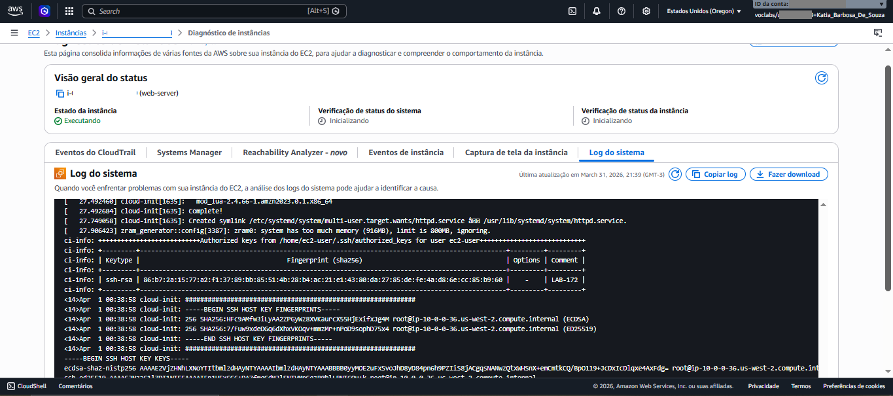
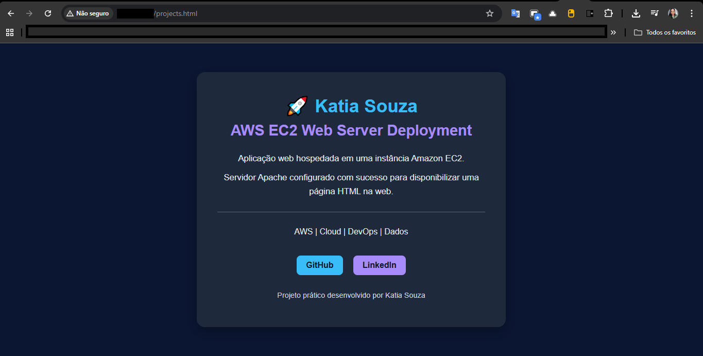

#  AWS EC2 Web Server Deployment

> Projeto prático desenvolvido como parte do programa **AWS re/Start**,  implantação de um servidor web Apache em uma instância Amazon EC2, com configuração completa de rede VPC.

---

## Sobre o Projeto

Este laboratório de desafio demonstra a implantação de uma aplicação web simples utilizando os principais serviços de infraestrutura da AWS. O objetivo foi colocar em prática os conceitos de computação em nuvem, redes virtuais e segurança aprendidos no programa re/Start.

---
### Fluxo da arquitetura

1. **Internet**  
   O acesso externo parte do navegador do usuário, utilizando o endereço IPv4 público da instância.

2. **Internet Gateway**  
   O Internet Gateway foi associado à VPC para permitir comunicação entre a rede da AWS e a internet.

3. **VPC — `vpc-ec2-lab`**  
   Foi criada uma VPC com bloco CIDR `10.0.0.0/16`, isolando logicamente os recursos do projeto.

4. **Tabela de rotas — `RT-publica`**  
   A Route Table foi configurada com a rota pública `0.0.0.0/0 → Internet Gateway`, permitindo tráfego externo.

5. **Sub-rede pública**  
   A instância EC2 foi provisionada em uma sub-rede pública, com associação à tabela de rotas e IP público habilitado.

6. **Security Group — `SG-lab`**  
   O grupo de segurança foi configurado para permitir:
   - **SSH (porta 22)** para administração remota via PuTTY
   - **HTTP (porta 80)** para acesso à aplicação web

7. **Instância EC2 — `web-server`**  
   Foi utilizada uma instância **t3.micro** com **Amazon Linux 2023**, responsável por hospedar o servidor web.

8. **Apache + aplicação web**  
   O Apache (`httpd`) foi instalado via **User Data**, e a página `projects.html` foi criada manualmente via SSH e publicada em `/var/www/html/`.

## Etapas da implementação

### 1. Criação da rede
Primeiro, foi criada uma **VPC** com CIDR `10.0.0.0/16` para isolar os recursos do projeto.

### 2. Criação da sub-rede pública
Dentro da VPC, foi criada uma **sub-rede pública** para hospedar a instância EC2 com acesso externo.

### 3. Configuração do Internet Gateway
Foi criado e associado à VPC um **Internet Gateway**, permitindo comunicação com a internet.

### 4. Configuração da tabela de rotas
A **Route Table** foi configurada com:
- `0.0.0.0/0 → Internet Gateway`
- `10.0.0.0/16 → local`

Isso permitiu que a sub-rede se tornasse pública.

### 5. Configuração do Security Group
Foi criado o **SG-lab**, liberando:
- **SSH (22)** para acesso remoto
- **HTTP (80)** para acesso ao site

### 6. Provisionamento da instância EC2
A instância **web-server** foi criada com:
- **Amazon Linux 2023**
- **tipo t3.micro**
- **IP público automático**
- **volume gp3**

### 7. Instalação automática do Apache
No momento da criação da instância, foi utilizado **User Data** para instalar e iniciar o Apache (`httpd`) automaticamente.

### 8. Acesso remoto via SSH
Após a criação da instância, o acesso remoto foi realizado via **PuTTY**, com autenticação por chave privada.

### 9. Criação e implantação da página web
A página `projects.html` foi criada manualmente com **nano** e movida para o diretório `/var/www/html/`.

### 10. Validação da aplicação
Por fim, a aplicação foi acessada no navegador por meio do **IPv4 público** da instância, confirmando o funcionamento do servidor web.

---

## User Data (Script de Inicialização)

O script abaixo foi executado automaticamente na criação da instância para instalar e configurar o Apache:

```bash
#!/bin/bash
dnf update -y
dnf install httpd -y
systemctl start httpd
systemctl enable httpd
chmod 777 /var/www/html
```

---

## Implantação da Página Web

### 1. Verificar o Apache

Após acessar a instância via SSH com **PuTTY**, foi feita a validação do serviço Apache:

```bash
sudo systemctl status httpd
```

### 2. Criar a página HTML
```bash
nano projects.html
```

```
# Criando a página HTML
<!DOCTYPE html>
<html lang="pt-BR">
<head>
    <meta charset="UTF-8">
    <meta name="viewport" content="width=device-width, initial-scale=1.0">
    <title>AWS EC2 Web Server | Katia Souza</title>

    <style>
        body {
            margin: 0;
            font-family: Arial, sans-serif;
            background: #0b1633;
            color: #e2e8f0;
            display: flex;
            justify-content: center;
            align-items: center;
            min-height: 100vh;
        }

        .container {
            background: #1e293b;
            padding: 40px;
            border-radius: 16px;
            text-align: center;
            width: 90%;
            max-width: 520px;
            box-shadow: 0 8px 25px rgba(0, 0, 0, 0.35);
        }

        h1 {
            margin: 0 0 10px;
            color: #38bdf8;
            font-size: 2.2rem;
        }

        h2 {
            margin: 0 0 25px;
            color: #a78bfa;
            font-size: 1.8rem;
        }

        p {
            font-size: 1.05rem;
            line-height: 1.6;
            margin: 10px 0;
        }

        hr {
            border: none;
            border-top: 1px solid #94a3b8;
            margin: 25px 0;
            opacity: 0.5;
        }

        .tags {
            margin-top: 10px;
            font-size: 1rem;
        }

        .links {
            margin-top: 25px;
        }

        .links a {
            display: inline-block;
            margin: 8px;
            padding: 10px 18px;
            border-radius: 8px;
            text-decoration: none;
            font-weight: bold;
            transition: 0.3s ease;
        }

        .github {
            background: #38bdf8;
            color: #0f172a;
        }

        .linkedin {
            background: #a78bfa;
            color: #0f172a;
        }

        .links a:hover {
            opacity: 0.85;
            transform: translateY(-2px);
        }

        .footer {
            margin-top: 20px;
            font-size: 0.9rem;
            color: #cbd5e1;
        }
    </style>
</head>
<body>

    <div class="container">
        <h1>🚀 Katia Souza</h1>
        <h2>AWS EC2 Web Server Deployment</h2>

        <p>Aplicação web hospedada em uma instância Amazon EC2.</p>
        <p>Servidor Apache configurado com sucesso para disponibilizar uma página HTML na web.</p>

        <hr>

        <p class="tags">AWS | Cloud | DevOps | Dados</p>

        <div class="links">
            <a class="github" href="https://github.com/Katia-Barbosa-Souza" target="_blank">
                GitHub
            </a>

            <a class="linkedin" href="https://linkedin.com/in/katia-barbosa-souza" target="_blank">
                LinkedIn
            </a>
        </div>

        <p class="footer">Projeto prático desenvolvido por Katia Souza</p>
    </div>

</body>
</html>
```

 O CSS completo está disponível no arquivo [`projects.html`](projects.html) deste repositório.


### 3. Mover para o servidor web
```bash
sudo mv projects.html /var/www/html/
```

Acesse no navegador:
```
http://<IPv4-público>/projects.html
```
---


## Configuração de Segurança

### Security Group — SG-lab

**Regras de entrada (Inbound):**

| Tipo | Protocolo | Porta | Origem |
|---|---|---|---|
| SSH | TCP | 22 | 0.0.0.0/0 |
| HTTP | TCP | 80 | 0.0.0.0/0 |

**Regras de saída (Outbound):**
- Todo o tráfego permitido

> ⚠️ Em produção, restrinja o acesso SSH ao seu IP específico ao invés de 0.0.0.0/0.

---

## Evidências

### Instância EC2 em execução


### Tabela de Rotas


### Grupo de Segurança


### Acesso SSH


### Log do Sistema (httpd instalado via cloud-init)


### Site Online


---

## Aprendizados

- Configuração completa de uma VPC do zero, incluindo sub-rede pública, internet gateway e tabela de rotas
- Como o **User Data / cloud-init** automatiza a instalação de serviços no boot da instância
- Importância do **Security Group** para controle de tráfego de entrada
- Diferença entre **IP público** e **IP privado** em instâncias EC2
- Validação de serviços Linux com `systemctl`
- Criação e edição de arquivos diretamente na instância via **nano**
- Acesso remoto via **SSH com PuTTY**, utilizando autenticação por chave privada
---

## Tecnologias


---
## 👩‍💻 Autora

**Katia Barbosa de Souza**  
*Estudante de Cloud Computing & Análise de Dados*

Explorando a AWS e o potencial dos dados para construir soluções práticas, eficientes e orientadas a resultados.

| [LinkedIn](https://www.linkedin.com/in/katiabarbosasouza/) | [Email](mailto:katiabarbosads@gmail.com) |

💡 *"A tecnologia transforma dados em decisões e oportunidades em resultados."* ☁️